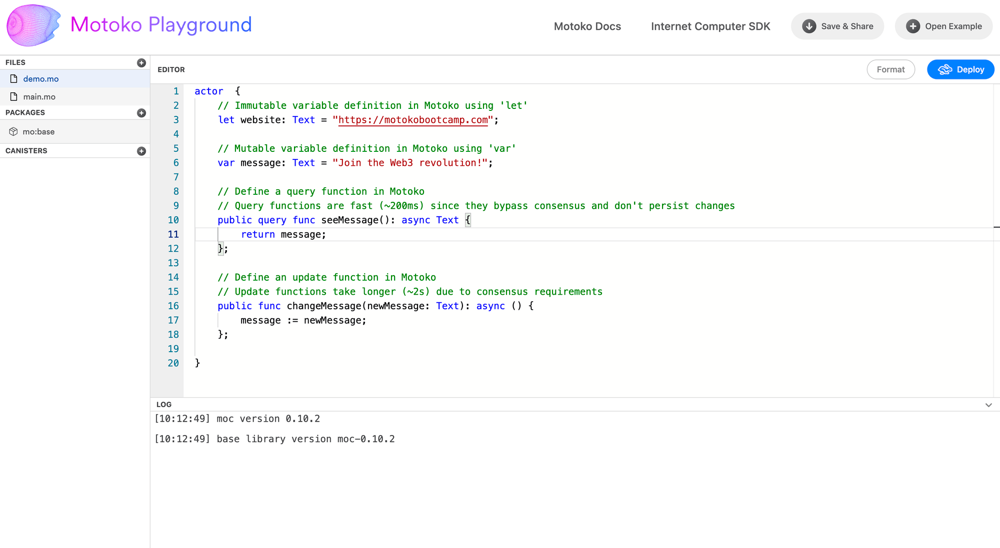
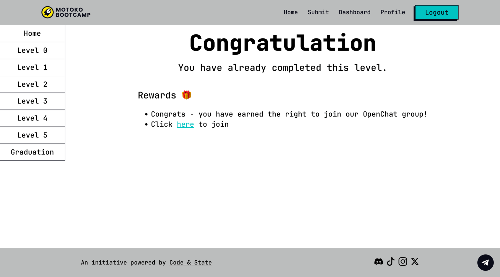

# Motoko Bootcamp - DAO Adventure - Initiation

> This repository is an initiation for the DAO Adventure. To check out the complete DAO Adventure repository, [click here](https://github.com/motoko-bootcamp/dao-adventure).

## 📌 Important Resources

- [Motoko Bootcamp Dashboard](https://motokobootcamp.com)
- [Motoko Playground](https://m7sm4-2iaaa-aaaab-qabra-cai.raw.ic0.app/?tag=3270740775)
- [Initiation Notion Guide](https://tomahawkvc.notion.site/Motoko-Bootcamp-Initiation-e84a4b9c5d5b4f7ebf9747b48e97ae12?pvs=74)
- [Initiation Video Guide](https://www.youtube.com/watch?v=Z3Z4X6Z3Z4E)
- [Digital Legacy Scroll](https://aki3l-syaaa-aaaaj-qa23q-cai.icp0.io/)

## ✨ Introduction

  

_In an alternate universe, the digital world is divided into various lands, with the Motoko Academy towering above the clouds. This prestigious academy is not just about learning to code; it's a place where novices are transformed into digital architects who shape the future of the digital world._

_The academy has a crucial initiation ritual, **The 1st dApp Challenge.** Aspirants must conquer this challenge to gain entry into the academy and unlock the mysteries of DAOs._

_At the heart of Motoko Academy lies the **Digital Legacy Scroll**, a dynamic record of achievement. Whenever a student successfully develops their app, their name and a personal message about their aspirations are added to this scroll. It serves as a living testament to the hard work and success of the academy's students, inspiring and celebrating their achievements._

_But the rewards extend beyond the scroll. Those who make it onto the list are granted access to **OpenChat**, an exclusive digital space reserved for the elite. This sanctuary for the curious and ambitious is rumored to hold the secrets to creating a DAO, making it a coveted destination for aspiring digital architects._

_As you approach the grand entrance, a luminous hologram greets you with an inviting voice, "Ready to shape the digital future?" It stands as the guardian of knowledge at the academy, guiding aspirants on their journey._

  

## 🎯 Mission

Your goal, should you decided to embark on this journey, is to successfully deploy your first application on the Internet Computer and submit it on the Motoko Bootcamp Dashboard. To achieve this, we will make use of the Motoko Playground, a web-based coding platform. This eliminates the need for any software installations on your computer.

## ✏️ Your Tasks

1. Register on the [Motoko Bootcamp Dashboard](motokobootcamp.com) and create an account. You'll need to click on the **Login** button on the top right corner of the page.

  

2. Develop your application by completing the 5 specified tasks in main.mo, available in the [Motoko Playground](https://m7sm4-2iaaa-aaaab-qabra-cai.raw.ic0.app/?tag=3270740775). Take inspiration from code in the [demo.mo](./src/demo.mo) file.

  

3. Once developed, deploy your application on the Internet Computer. You can do this by clicking on the **Deploy** button on the top right corner of the Motoko Playground.

4. Submit your canister on [motokobootcamp.com](https://motokobootcamp.com) to complete the initiation challenge.

  

5. If your submission is valid, you will automatically leave your mark on the [Digital Legacy Scroll](https://aki3l-syaaa-aaaaj-qa23q-cai.icp0.io/) and you'll gain access to Motoko Bootcamp OpenChat Community.

  

## Motoko pill 💊

> The Motoko Bootcamp is a 7 day transformative journey that turns beginners into digital heroes. It is an initiative organized and supported by [Code & State](https://www.codeandstate.com/). Make sure to register for the next Bootcamp on [motokobootcamp.com](https://www.motokobootcamp.com/)

    
    
    

## Meme of the day 🙈

> This meme is brought to you by a fellow Motoko Bootcamp student. If you have a meme you'd like to share, please send it to us on the [memes](https://discord.gg/vwEC5RcKBv) channel - we'll feature the best ones here.

